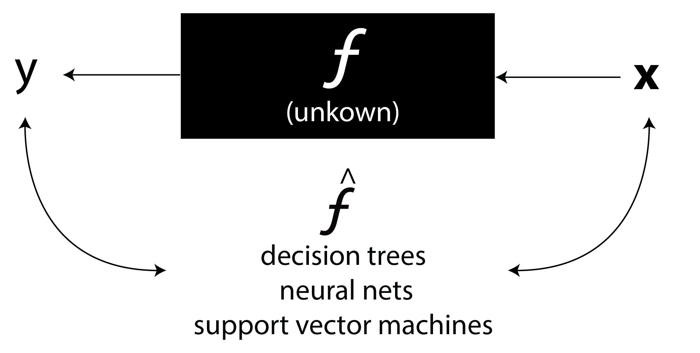
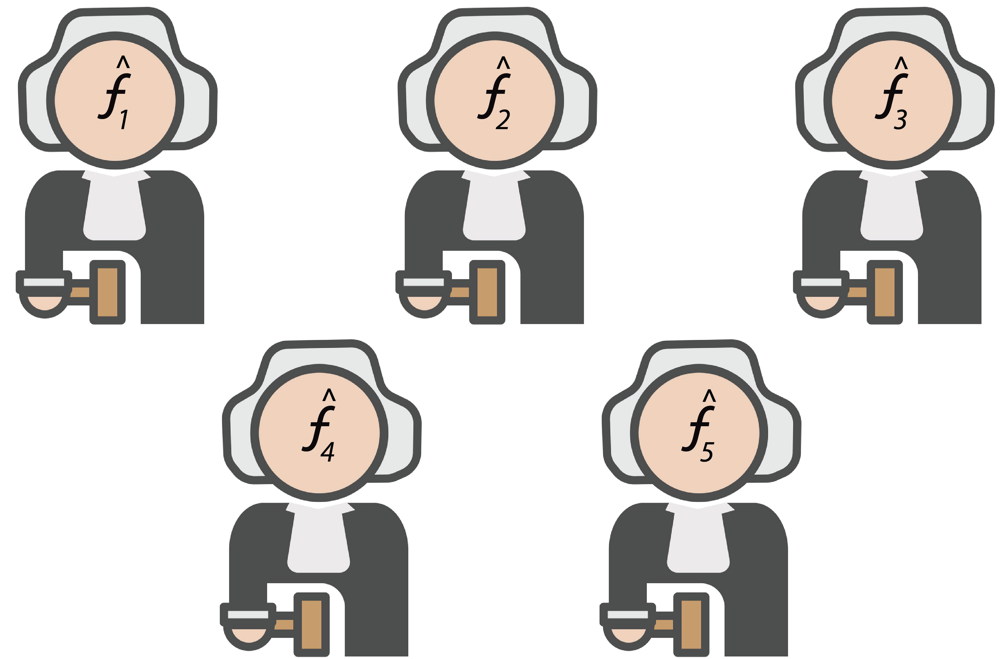
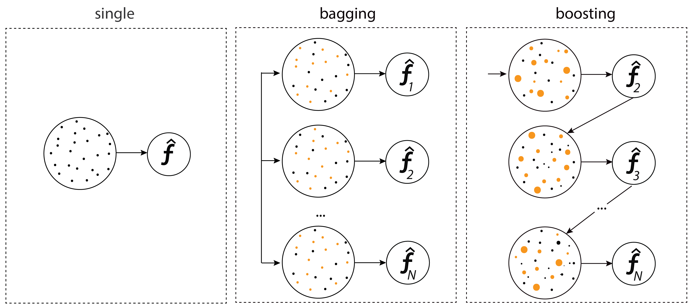
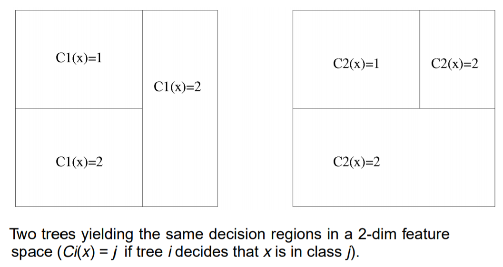
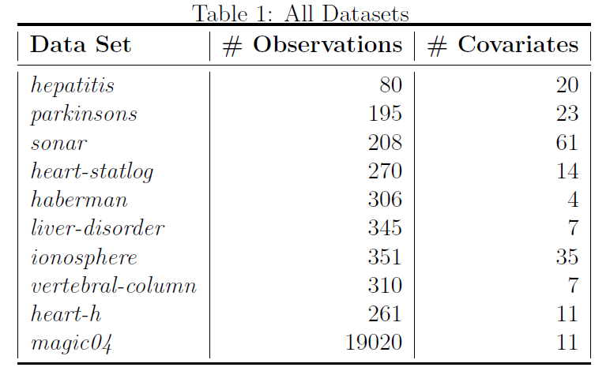

```{r setup, include=FALSE}
options(htmltools.dir.version = FALSE)
```

# Introduction: Supervised Statistical Learning

- Suppouse ${\displaystyle X}$ as the vector space of all possible observations.

- Suppouse ${\displaystyle Y}$ as the vector space of all possible outcomes from the observations.

- Given the space of functions ${\mathcal {H}}$ that $f:X\to Y$

### The main objective is to estimate a function $\hat{f}$, from ${\vec  {x}} \in {\displaystyle X}$, and $y \in {\displaystyle Y}$, such that $\hat{f}({\vec  {x}})\sim y$.

---
#The true **blackbox**

.center[]
<br/>
<br/>

.center[ Adapted image from Breiman, L., 2001]

---
class: inverse, center, middle

# Ensemble Methods

---

# Ensemble Models

.center[]

---

# Ensemble Models

.center[]


---
# Bagging and Boosting

<br/>
<br/>
.center[]


---
# Ensemble Methods


.pull-left[

## Bagging

1. Bagging predictors (Breiman, Leo; 1996)

1. The Random Subspace Method for Constructing Decision Forests (Ho, T.K; 1998)

1. Random Forests (Breiman, Leo; 2001)

]

.pull-right[

##Boosting

1. Adaptative Boosting (Freund and Schapire,1999)

1. Gradient Boosting (Friedman, 2001)

1. Stochastic Gradient Boosting (Friedman, 2002)

1. eXtreme Gradient Boosting (Chen, et. al, 2016)

1. LightBoosting (Ke, et. al, 2017)]

---

# The importance of Ensemble Methods

- The KDD-Cup: The years of (2009-2011) all the first-place and second-place winners used ensemble methods.

- Netflix Prize ($1,000,000).

- Kaggle's Competitions: Among the 29 challenge winning solutions published at Kaggle’s blog during 2015, 17 solutions used XGBoost.
---

class: inverse, center, middle

# Bagging

---

##.center[*Booststraping Aggregation*]

### Regression Problems
 $$\hat{F}_{bag}(\mathbf{x})=\frac{1}{B}\sum_{b=1}^{B}\hat{f}_{b}(\mathbf{x})$$
### Classification Problems
 $$\hat{F}_{bag}(\mathbf{x})=sign\left(\sum_{b=1}^{B}\hat{f}_{b}(\mathbf{x})\right)$$

---
# Bagging: Pseudo code
1. Sample, with replacement, a *b* dataset of the same size as the whole data set ( *B* bootstraping samples).

--

1. Train a models to each boostrap sample.

--
1. The ensemble prediction is given by:

   **the mean** from all predictions from models (for regression tasks)<br/>
   
   **the majority vote** among all models (for classification tasks)


---
# The Random Subspace Method for Constructing Decision Forests

.pull-left[
.center[]
.center[Tin Kam Ho]
]

.pull-right[
###"It is important to note that forest accuracy is affected by both the individual tree accuracy and the agreement between the trees.  [...]
###Ideally, one should look for the best individual trees with lowest similarity." 
]

---
# Agreement and Similarity Between Models

.center[]

.center[Tin Kam Ho]

---
# Random Forests

.pull-left[
.center[]
.center[Leo Breiman]

]

.pull-right[
Random forests are a combination of bagged tree predictors such that each tree depends on the values of a random vector sampled independently and with the same distribution for all trees in the forest.
]


---

# Random Forests


.pull-left[
.center[]
.center[Leo Breiman]

]

.pull-right[
### "Our results indicate that better (lower generalization error) random forests have lower correlation between classifiers and higher strength. The randomness used in tree construction has to aim for low correlation $\bar{\rho}$ while maintaining reasonable strength."
]

---

class: inverse, center, middle

# Bagging


## Strength vs. Correlation

---
# Strength vs. Correlation

<br/>

<br/>

.center[
- What are others ways to explore the relationship between Strength and Correlation between models that compose the bagging ?

- How measure correlation between different models ?
]

---
class: inverse, center, middle

#Boosting

---
#Boosting

.center[]

---


# AdaBoosting

Given $$\mathbf{y}\in\{1,-1\}$$
<br/>
<br/>

$$G(\mathbf{x})=sign \left(\sum_{m=1}^{M} \alpha_{m}g_{m}(\mathbf{x}) \right)$$

--
<br/>
<br/>
##.center[The weighted wisdom of a crowd of experts]


---
# AdaBoosting

<br/>
<br/>

.center[]

---
.center[#Suppose we have a computationally efficient learning algorithm that can generate a hypothesis which is slightly better than random guessing for any distribution over the inputs. Does the existence of such a ‘‘weak’’ learning algorithm imply the existence of an efficient ‘‘strong’’ learning algorithm that can generate arbitrarily accurate hypotheses?]

---
class: inverse, center, middle

# Yes 

(Schapire and Freund, 1998)

---
# A systematic comparison between different base learners in AdaBoosting model

- Compare different common models in their simplest form (weak learner)

- Test the perfomance over 10 different datasets

- Validation: 30 Repeated Holdout 

- Split Ratio: 70-30% of Training-Test


---

# Models

- **K Nearest Neighbors (KNN)**
- **Linear Discriminant Analysis**
- **Logistic Regression** in canonical form.
- **Neural Networks** with one perceptron.
- **Support Vector Machines** with the linear kernel.
- **Decision Trees** with just one split node (Stump Models).


---
# Datasets

.center[]

---

#Some Results

```{r  out.height=520, echo=FALSE}
knitr::include_graphics(path = "plot8.png")
```
---
# Final comments

- The ensemble methods in the Statistical Learning field demonstred significante relevance as it has been showed in high predictive capacity.

- There are some open questions which can be explored in the ensemble preceedings, e.g: corelation and strength.

# Future Works

- Comparisson between ensemble methods and others competitive methods

- Explore the strength and corelation between models in order to improve the predictive power of ensemble

- Propose new ensemble methods

---
##References

- Breiman, Leo. "Statistical modeling: The two cultures (with comments and a rejoinder by the author)." Statistical science 16.3 (2001): 199-231.

- Breiman, Leo. "Bagging predictors." Machine learning 24.2 (1996): 123-140.

- Ho, T,K. " The random subspace method for constructing decision forests." IEEE Trans. Pattern Anal. Mach. Intell 20.8 (1998): 1-22.

- Breiman, Leo. "Random forests." Machine learning 45.1 (2001): 5-32.

- Freund, Yoav, Robert Schapire, and Naoki Abe. "A short introduction to boosting." Journal-Japanese Society For Artificial Intelligence 14.771-780 (1999): 1612.

- Friedman, Jerome H. "Greedy function approximation: a gradient boosting machine." Annals of statistics (2001): 1189-1232.

- Friedman, Jerome H. "Stochastic gradient boosting." Computational statistics & data analysis 38.4 (2002): 367-378.

- Chen, Tianqi, et al. "Xgboost: extreme gradient boosting." R package version 0.4-2 (2015): 1-4.


---
##References

- Ke, Guolin, et al. "Lightgbm: A highly efficient gradient boosting decision tree." Advances in Neural Information Processing Systems. 2017.

- Schapire, Robert E., et al. "Boosting the margin: A new explanation for the effectiveness of voting methods." The annals of statistics 26.5 (1998): 1651-1686.

---
class: title-slide-final, middle
background-image: url(https://upload.wikimedia.org/wikipedia/commons/thumb/4/40/Bras%C3%A3o_da_UFBA.png/300px-Bras%C3%A3o_da_UFBA.png)
background-size: 85px
background-position: 9% 15%

# Thanks for your attention!

.pull-down[

<a href="mailto:mateusmaia11@gmail.com">
.white[`r icon::fa("paper-plane")`mateusmaia11@gmail.com]
</a>

<a href="https://mateusmaiads.github.io/ensemble_qualify">
.white[`r icon::fa("link")` mateusmaiads.github.io/ensemble_qualify]
</a>

<a href="https://twitter.com/MateusMaiaM">
.white[`r icon::fa("twitter")` @MateusMaiaM]
</a>

<a href="https://github.com/MateusMaiaDS">
.white[`r icon::fa("github")` @MateusMaiaDS]
</a>

<br><br><br>

]
